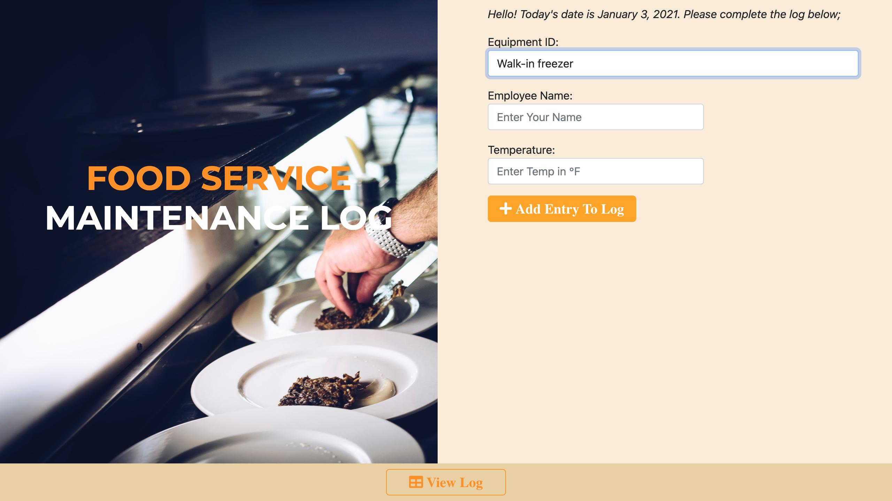
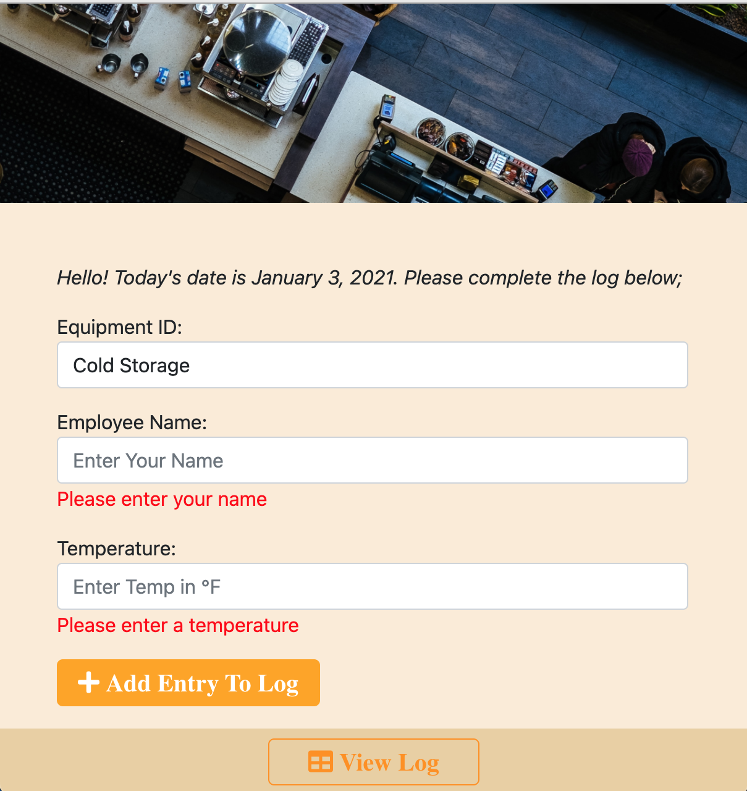

# Food Service Log Manager

## Table of Contents

[About](https://github.com/AndreDiop/Collaborative-project/blob/main/README.md#About)

[Installation](https://github.com/AndreDiop/Collaborative-project/blob/main/README.md#Installation)

[Usage](https://github.com/AndreDiop/Collaborative-project/blob/main/README.md#Usage)

[Screenshots](https://github.com/AndreDiop/Collaborative-project/blob/main/README.md#Screenshots)

[Contributing](https://github.com/AndreDiop/Collaborative-project/blob/main/README.md#Contributing)

[Licenses](https://github.com/AndreDiop/Collaborative-project/blob/main/README.md#Licenses)

## About

The Food Service Log Manager seeks to cut down on the amount of paperwork
required for food service establishments and simplify the process of taking,
storing, and indexing temperature logs.

With the Food Service Log Manager, users will be record the temperature of
equipment and log the results to timestamped log which is sent to an email
address to be indexed and saved via the inbox.

The taking and recording of accurate temperatures is a required and integral
element to insuring that restaurants and employees are serving safe product to
customers. With these required daily logs, the paper trail can become
mountainous as logs are suggested to be kept for 6 months!

Aside from health regulation compliance, the benefits of keeping accurate logs
with the Food Service Log Manager are:

• Safer, better tasting food for customers; • Shelf life of foods will be
extended by knowing exactly how your food temperatures run from day to day; •
Less food waste by maintaining correct food temperatures; • Great daily learning
tool to build food safety skills for employees; • Improved results on health
inspections and internal company quality reports; • Faster awareness of
refrigeration maintenance problems;

## Installation

The Food Service Log Manager makes use of several the following API's

- Unsplash API to generate random images for the home page

## Usage

Accessing the site through the deployed link:

[Food Service Log Manager deployed link](https://andrediop.github.io/Collaborative-project/)

Users will arrive at the home page where they will be instructed to select the
equipment that they will be taking the temperature of.

Users will then input their name and input the temperature of the selected
equipment.

To store this information, the user will add this entry to the log by clicking
the button labeled _Add entry to log_.

The Github repository

[Food Service Log Manager Git Hub Repository](https://github.com/AndreDiop/Collaborative-project)

## Screenshots



```bash

```


_Users are presented with a prompt when information is not added._



## Contributing

Special thanks to Georgia Tech Boot-camp staff for the positive feedback and
support.

Production Team:

- [Paul Keldsen](https://github.com/Pkeld148)
- [Lisa Copeland](https://github.com/stopdaydreaming)
- [Sahil Patel](https://github.com/Spatel134)
- [Andre Diop](https://github.com/AndreDiop)

## License

[MIT](https://choosealicense.com/licenses/mit/)

Copyright (c) 2020

Permission is hereby granted, free of charge, to any person obtaining a copy of
this software and associated documentation files (the "Software"), to deal in
the Software without restriction, including without limitation the rights to
use, copy, modify, merge, publish, distribute, sublicense, and/or sell copies of
the Software, and to permit persons to whom the Software is furnished to do so,
subject to the following conditions:

The above copyright notice and this permission notice shall be included in all
copies or substantial portions of the Software.

THE SOFTWARE IS PROVIDED "AS IS", WITHOUT WARRANTY OF ANY KIND, EXPRESS OR
IMPLIED, INCLUDING BUT NOT LIMITED TO THE WARRANTIES OF MERCHANTABILITY, FITNESS
FOR A PARTICULAR PURPOSE AND NONINFRINGEMENT. IN NO EVENT SHALL THE AUTHORS OR
COPYRIGHT HOLDERS BE LIABLE FOR ANY CLAIM, DAMAGES OR OTHER LIABILITY, WHETHER
IN AN ACTION OF CONTRACT, TORT OR OTHERWISE, ARISING FROM, OUT OF OR IN
CONNECTION WITH THE SOFTWARE OR THE USE OR OTHER DEALINGS IN THE SOFTWARE.
